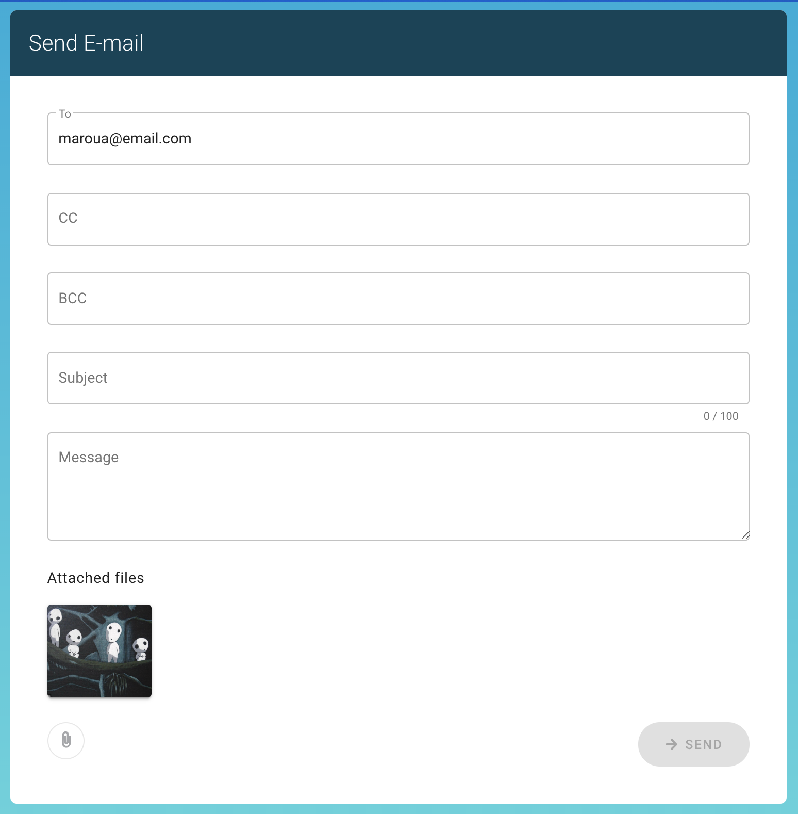

# Vue email Composer


This is Vue email composer is built using Vuetify, a Material Design based Framework, a reusable semantic component framework for Vue.js.

The project was initialized using Vue Cli-3.

The form data is handled using a simple Vuex store with no modules.

I've created a input and button global reusable components for good practice, registered globally in the main.js.

`vue.config.js` loads the `main.scss` file and makes the global styles available globally - to avoid an import in every component.

Vuetify works quite well with v-validate and veevalidate. I've added error messaged to the fields with small labels as it makes it clear what is wrong.
The user can add more than one email per field in this format:

"test@email.com, anotheremail@test.com"

After submitting the form the user will see a confirmation page with a new button(wasn't in the design) that will let the user navigate back to the home page.

The use of a Vuex store here make it easy to handle the form data with a persistent state to be able to easily re use the form data.

At the moment the form doesn't actually send the email.

Testing made using the [vue-test utility](https://vue-test-utils.vuejs.org/).

-----

## Project setup
```
yarn
```
### Compiles and hot-reloads for development
```
yarn dev
```
### Run tests

```
yarn test:unit
```

See Vuetify docs [Docs Reference](https://vuetifyjs.com/en/getting-started/).

See [Configuration Reference](https://cli.vuejs.org/config/).
